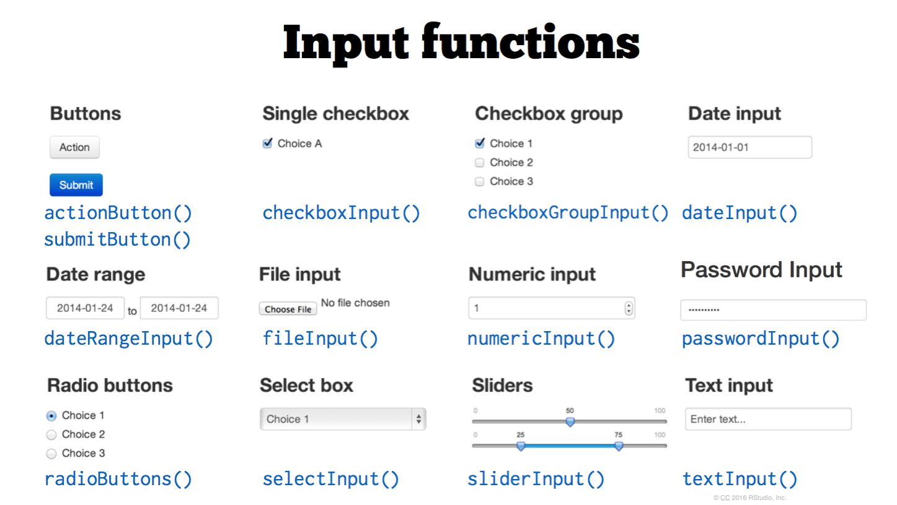
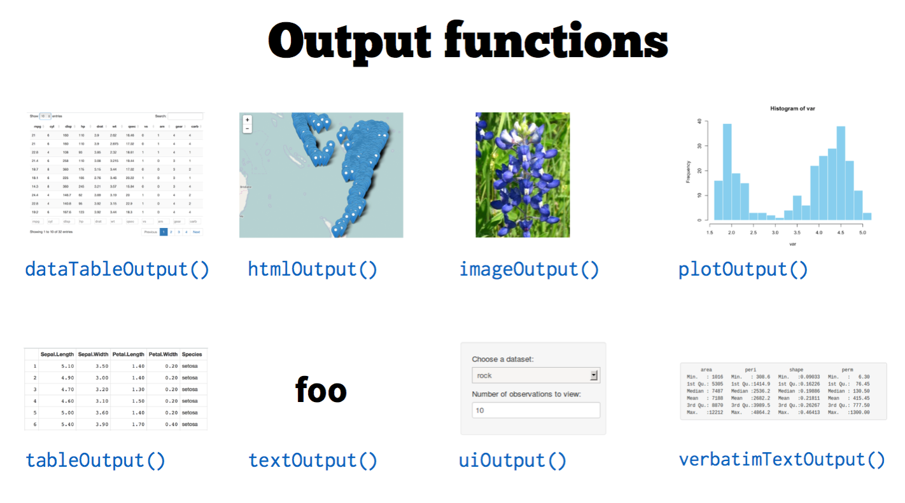
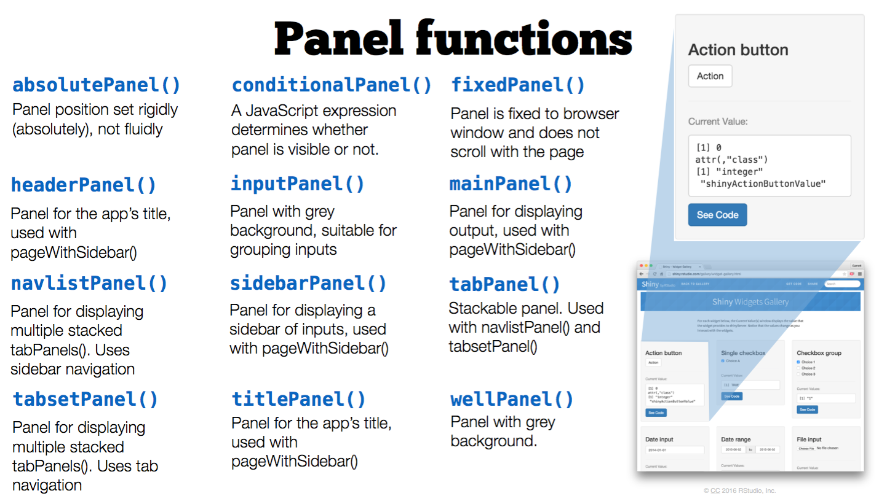
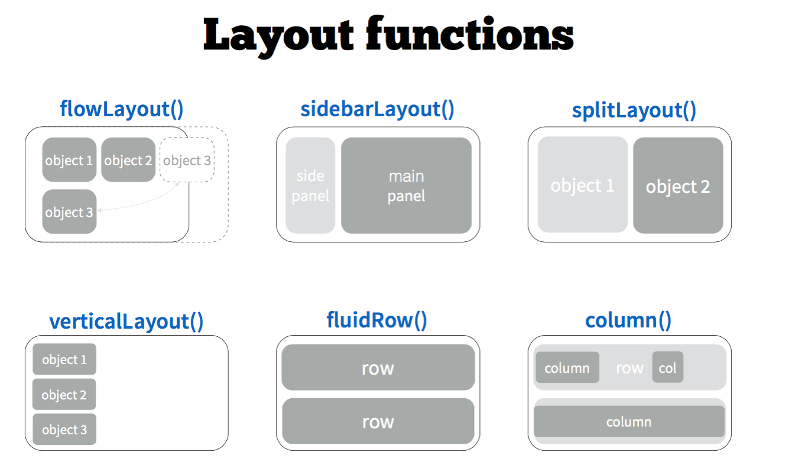
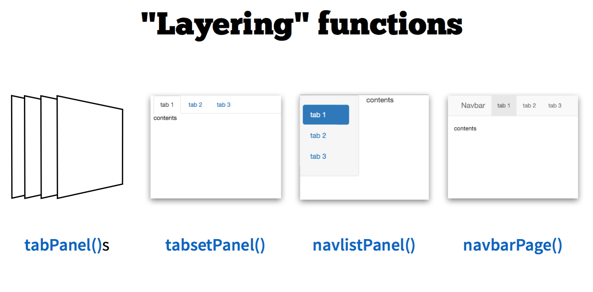

# Agenda

## Agenda

- What is Shiny?

- Examples.

- Next steps and resources.

## These learning materials

- These slides were created in rmarkdown using reveal.js. Read more about it  [here](http://rmarkdown.rstudio.com/revealjs_presentation_format.html). 

- You can access these slides on here.

[ibriancarter.github.io/bds-pres/index.html](ibriancarter.github.io/bds-pres/index.html). 

- All code for examples and creating these slides are on Codehub: 

[ibriancarter.github.io/bds-pres/](ibriancarter.github.io/bds-pres/). 

# Introduction 

## Motivation

R is a powerful tool for data analysis

- State of the art statistical power.

- Excellent for visualization (ggplot2).

- Large community of users. <br>

but...

<div class="fragment">
- Personal experience, not a shared one. 

- Output is usually in static formats.

- DS projects go to PowerPoint to die. 

- Modern visualization is interactive and browser-based. 
</div>

## Data Products

- Data product is the **production output** from a statistical analysis.

- Automate complex analysis tasks.

- Expand the utility of a data information model, algorithm or inference. 

<small>*Roger Peng, Developing Data Products, Coursera (see links)*</small>

<div class="fragment">
- The analysis is complete and conclusions reached.

- Build an **artifact** for other people to engage with your conclusions.

- Not the end, may lead to further work - *it lives...*
</div>

<aside class="notes">
It is important that the process of building the application or artifact does not detract from the analysis that you are trying to complete. 
</aside>

## What is Shiny?

- A web application framework for R.

- Modern web UI with attractive defaults.

- Requires no knowledge of HTML, JavaScript or CSS
    + but with a little knowledge is completely customizable.

- Integrates with existing JavaScript libraries (D3, Leaflet, etc.).

- Reactive programming model. 

- Use R packages in real time with given data and inputs.

but ....

<div class="fragment">
- Not designed to serve many users.

- Not going to build a web-store.

<aside class="notes">
Reactive programming allows dramatically simpler code. Build great user interfaces very robustly/concisely. 

It is not intended for general purpose. Doesn't replace Ruby on Rails. You wouldn't build a web-store with it. 

</aside>


## Examples

[RStudio Examples](https://shiny.rstudio.com/gallery/)


[Show me Shiny](http://www.showmeshiny.com/)

[Kaggle 2nd Place Winner: Santander](https://tvdwiele.shinyapps.io/Santander-Product-Recommendation/)

# Learning


## Five Examples

- Intro to Shiny Reactive

<div class="fragment">
    Model–view–controller (MVC) vs Reative paradaigms.
    Angular.js (Google) vs. React.js (Facebook). 
    Shiny Reactive predates React.js but same paradaigm
</div>

- Input Widgets

- UI Layouts

- Plot Example (ggplot)

- Multiple Ways of Creating a Shiny App

- Recap 

## (1) Reactive

```{r,eval=F}
ui <- shinyUI(fluidPage(
  
  textInput(inputId = "identity", 
            label = "Who are you?", 
            value = "World"),
  textOutput("helloAns")
))

server <- shinyServer(function(input, output) {
  
  #Most caputre input in a reactive function()
  myAnswer <- reactive(paste("Hello", input$identity))

  #Note call the function myAnswer()
  output$helloAns <- renderText({ myAnswer() })
})
```

> - all **render**XXX can accept *reactive* values()

> - reactive() always listening funciton... 

<!--- want this code chunk to appear incrementally--->
<div class="fragment">
```{r, eval = F}
output$helloAns <- renderText({paste("Hello", input$identity)})
```
</div>

<aside class="notes">
example-1.r

Introduce:

a) UI function and the server function
1) UI Input - textInput
2) Reactive capture and render
3) UI Output
</aside>


## (2) Input Widgets

```{r,eval=F,fig.height=7}
ui <- shinyUI(fluidPage(
  
  extInput("identity", "Who are you?", value = "World"),
  selectInput("language","What language would you like?", 
              choices = c("English", "Irish", "Hindi")),
  textOutput("helloAns")
))

server <- shinyServer(function(input, output) {
  
  lookup <- data.frame(
    language = c("English", "Irish", "Hindi"),
    salutation = c("Hi", "Dia Duit", "Namaste"))
  
  output$helloAns <- renderText({
    paste(lookup$salutation[lookup$language==input$language],
          input$identity)
  })
```

<aside class="notes">
example-2.r

Go over the 3 stage paradigm again, introduce different type of UI Widget

selectInput. Add  selected = "Irish"

Many types of input widgets available - radiobuttons, check boxes, 
a) UI function and the server function
1) UI Input - textInput
2) Reactive capture and render
3) UI Output
</aside>

---


## (3) Layouts

```{r,eval=F}
ui <- shinyUI(fluidPage(
  
  sidebarLayout(
    
    sidebarPanel(
      checkboxInput("dummyBox2","Check and uncheck"),
      sliderInput("dummySlider","Move the slider",
                  min = 0,max = 1,value = 0.5)
    ), #end of sidebarPanel
    
    mainPanel(
      h1("Not a lot going on here")
      ) #end of mainPainel
  
    )#end of sidebarLayout
)#end of fluidPage
)#end of UI

server <- shinyServer(function(input, output) {})


```

<aside class="notes">
example-3.r

Add in a tabpanel
tabsetPanel(
tabPanel("Tab1",h1("Not a lot in tab1")),
tabPanel("Tab2", h2("Or tab two but smaller")))

</aside>


## Recap

- UI Layout

- 1 - UI Inputs

- 2 - Rendering Functions

- 3 - UI Outputs

> - https://shiny.rstudio.com/reference/shiny/latest/

## (4) Plot Example

```{r, eval = F}
ui <- shinyUI(fluidPage(
  
  # Application title.
  titlePanel("Finally a plot"),
  
  sidebarLayout(
    sidebarPanel(
      selectInput("col_i", "Choose numeric column to graph:", 
                  choices = c(colnames(mtcars))),
      sliderInput("numBins_i","Choose number of bins",
                  min = 5,max = 30,value = 10),
      numericInput("numRows_i", "Number of rows to view:", 10)
    ),#End sidebarPanel
  
    mainPanel(
      h4("Histogram"),
      plotOutput("mHist_o"),
      
      h4("Observations"),
      tableOutput("mRows_o")
    )# End main panel
  )#end sidebarLayout
)#end fluidPage
)#end UI
  
 
server <- shinyServer(function(input, output) {
  
  # Show the first "n" observations
  output$mRows_o <- renderTable({
    head(mtcars)
  })
 
  # Create histogram 
  output$mHist_o = renderPlot({
    ggplot(mtcars, aes(x=qsec)) + geom_histogram()
  })
  
})
```


## (5) Multiple ways of creating shiny apps

Have created *ui* and *server* functions() in file and called each function from file.

<div class="fragment">
```{r, eval=F}
shinyApp(ui = ui, server = server)
```
</div>

> - Can also created two file *ui.R* and *server.R* save in a directory *myApp* and from command line of parent directory run. (example-5a)

<div class="fragment">
```{r, eval=F}
library(shiny)
runApp("~/myApp")
```
</div>

<div class="fragment">
### Further learning
</div>

> - rmarkdown with a runtime:shiny (example-5b)

> - shinydashboard()  (example-5c)

> - rmarkdown + shinydashboard = flexdashboard.rmd (example-5d)

## Recap 2

---



---



---



---



---




# Next Steps

## Start Building

Enough knowledge to start creating apps. Give it a go. Break some stuff. Get confused. More than happy to help out. 

## More Learning Sessions?

- Best way forward. (Intent of sessions)? More Sessions? 

- reactive - ladder of enlightenment (6 steps)

- expanding with htmlwidgets

    + brushing and linking!!! 

- layouts - shinydashboard, flexdashboard

- deploying apps on our server using Shiny Server

    + using RStudio project and packrat library

    
## Links {#links}

<style> #links {font-size: 0.6em}</style>

#### Coursera

[Developing Data Products](https://www.coursera.org/learn/data-products) <br>
[DDP Videos](https://www.youtube.com/playlist?list=PLpl-gQkQivXjTm0HLZZaNXf1LnlFSSVX4) <br>
[DDP github](https://github.com/DataScienceSpecialization/Developing_Data_Products) <br>


[Building Shiny apps](http://stat545.com/shiny00_index.html) 


#### RStudio

[Tutorials](http://shiny.rstudio.com/tutorial/) <br>
[Cheatsheet](http://shiny.rstudio.com/images/shiny-cheatsheet.pdf) <br>
[Articles Really Good](http://shiny.rstudio.com/articles/) 


#### Example Apps

[Show Me Shiny - lots of Examples](mhttp://www.showmeshiny.com/) <br>
[User Showcases from RStudio](https://www.rstudio.com/products/shiny/shiny-user-showcase/) <br>
[Learn some simple stats](http://www2.stat.duke.edu/~mc301/shinyed/) <br>

#### Videos/Talks

https://youtu.be/MrQVzz2POD4 - *Joe Cheng, Key Package Author* <br>
https://youtu.be/HxeHNQojVc44 - *Winston Chang, Key Package Author* <br>


# Backup slides

## Documentation

Deployment on Shiny Server 

FAQ (related to Shiny Server and deployment) 


