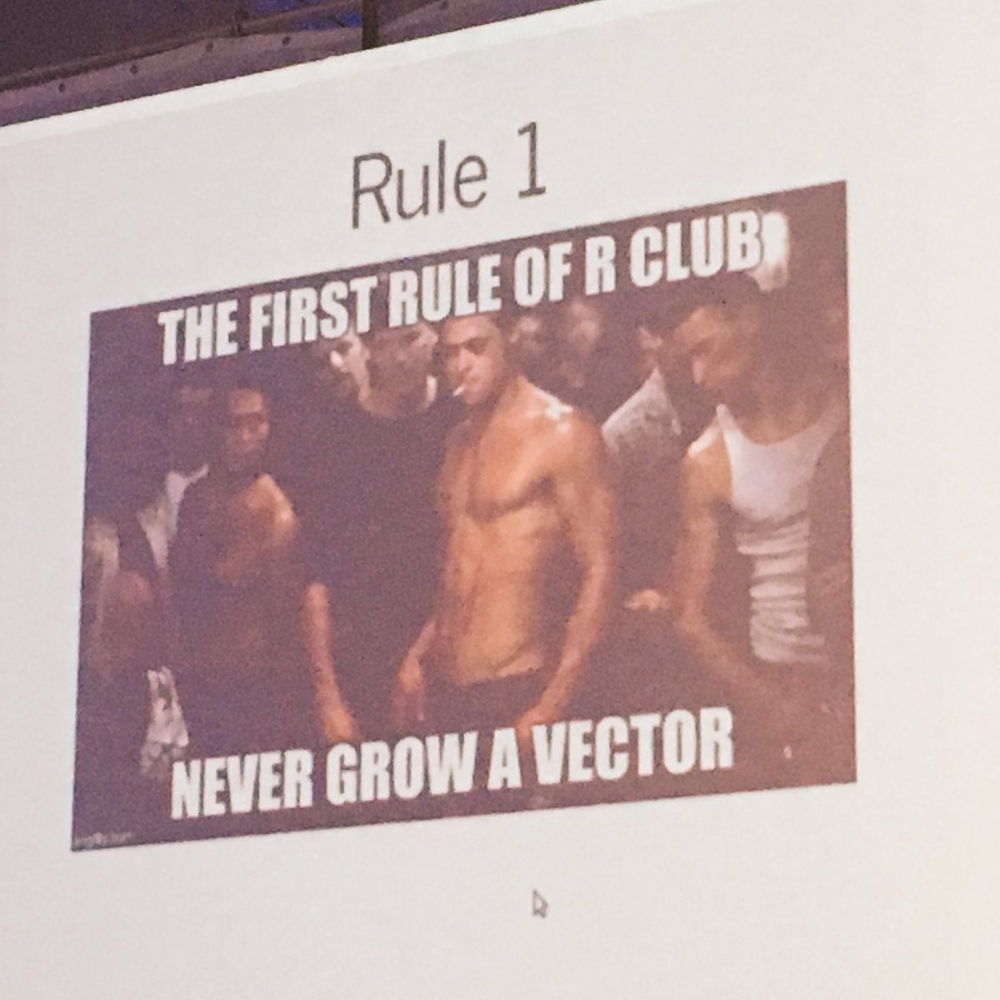
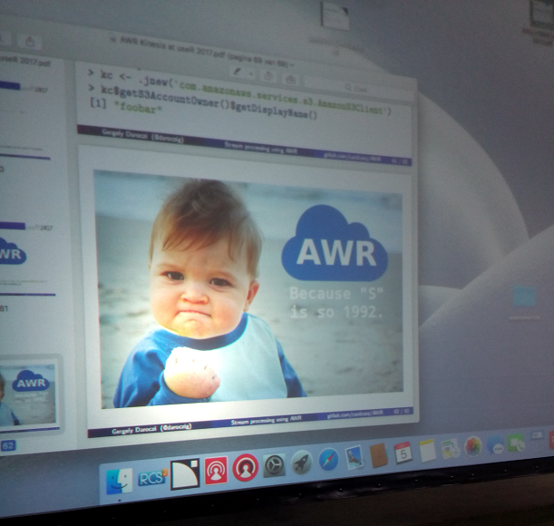
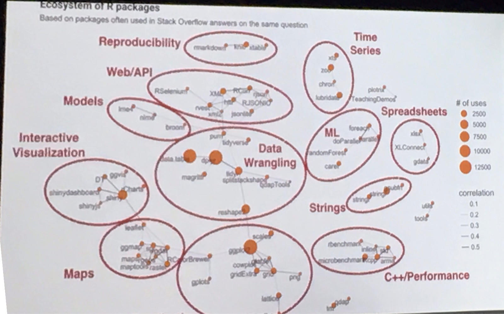
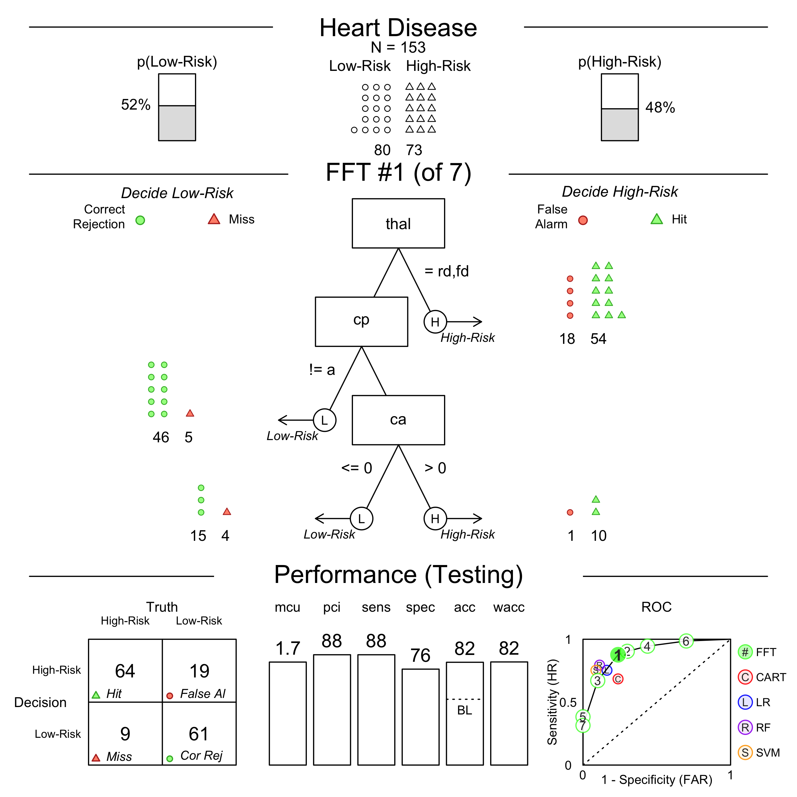
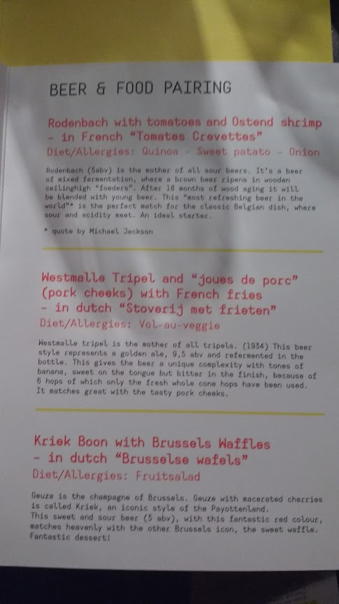

# Introduction

The conference was sold out, with 1000 attendees. There was 4 days of talks. The first day was tutorials of 3 hours in duration. The other 3 days were a mix of short 18 minute talks, longer keynotes and some sponsor talks. This report gives a general outline of the the key themes at over the conference and reviews of talks that I attended and interesting links etc. 

A copy of the complete schedule can be found [here](https://user2017.brussels/schedule)

## Three Highlights

There was a lot of info at the conference. My top three talks I found were. 

[Efficent R Programming](#efficent-r-programming)

[ShinyProxy](#shinyproxy)

[Fast Frugal Decision Trees](#fftrees:-an-r-package-to-create,-visualise-and-use-fast-and-frugal-decision-trees)

## Themes

The useR attendees are a mix of "casual" R programmers, who have picked up the language for a particular use case (in academia or business), "heavy" R programmers, such as your typical data scientist/statistician and "contributor" R users, who are active in in developing new packages and standards. 

In that vein I will group the themes accordingly.

### Tutorials

There were 16 tutorial sessions run on the Tuesday, each 3 hours long,  in the following areas

- `Reproducibility` -  Open & Reproducible Research, OpenML Platform
- `Medical Stats` - Dose-response analysis, Sports Analytics
- `GIS` - Geo-spatial visualization, Modelling the environment in R, Spatial data in R
- `Algorithms` - Bayesian with R with JAGS, Optimal Change point detection
- `Distributed Computing` - Parallel computing
- `C++ and Efficency` - Rcpp, efficient R Programming, 
- `Packages` - purrr, data.table
- `NLP` - Natural Language Processing
- `Development` - package development with R-hub : new directions

I attended the talks on Rcpp and Efficient R Programming. 

### Talks

Key Themes 

**Machine Learning**

- `Clustering` - Topic specific methods of clustering. some topic specific
- `Statisical Modeling` - Regression , forecasting, mixed models 
- `Machine Learning` - Tree techniques, re-enforcement learning, deep learning.
- `GIS` - Connecting QGIS, Google's spherical geo library, new libraries
- `Text Mining` - tidy text mining
- `Outlier` - outlier detection techniques. O3 Plot

**Programming**

- `Packages` - R Documentation, Error Messaging, Ensemble-ing packages, R6 Class System
- `Programming` - Docker, Compilers, Bench-marking, Byte Code Compiler, tidyverse grammar
- `Shiny` - Scaling Shiny Apps, Database Connectivity with Shiny, Novel Applications
- `interactive graphics` - ggigraph, tmap
- `Highly Parallel` Computing - AWS, Big Data, Spark & Docker, Stream processing

**Other**

- `business` Experiences of using Shiny and best practices for statistical analysis in business setting.
- `visualisation` - visualization techniques, studies and journalism use of R.
- `web` - using key authentication, rvest, web APIs
- `reproducability` - of studies, codebooks, Docker Containers
- `education` - using R to teach ML, States. Best methods of teaching R.
- `topic specific` - Medical Statistics, Bioinformatics, Psychometric, Social Statistics

# Review of Talks

## Tuesday 5th July

### Rcpp from Simple Examples to Machine Learning

- The 'Rcpp' package provides R functions as well as C++ classes which offer a seamless integration of R and C++.
- Can offer large speed improvements. 
- Over 1000 R packages depend on Rcpp and as a result most often downloaded package on CRAN. 
- Good Linear Algebra needed for ML part. 
- [Slides](http://dirk.eddelbuettel.com/papers/useR2017_rcpp_tutorial.pdf)

### Efficent R Programming

- Covered some of the same ground as first tutorial. 
- set-up: the .Rprofile and .Renviron files, the importance of a good IDE, and switching BLAS libraries.
- assessing your computer hardware with the benchmarkme package.
- collaboration: coding guidelines and the importance of version control.
    - use travis

<blockquote> The real problem is that programmers have spent far too much time worrying about efficiency in the wrong places and at the wrong times; premature optimization is the root of all evil (or at least most of it) in programming. (Donald Knuth) </blockquote>

- programming: common R data types, good programming techniques, parallel computing and the byte compiler.
    - byte compile packages to get a speed bump. For R v3.4 JIT compiler implemented. 
    - change Renviron to bytoe compile all your packages. 
- parallel - if a for loop can be written in reverse it can be easily parallised. 

- learning: practical suggestions for improving your general R knowledge.
    - do not rbind (don't grow vectors if you can avoid)

- C++ programming: A brief introduction to Rcpp.
    - downside of C++ is there is a lot to lerm
    - upside a lot has been implemented really well already. 

[Slides will be up on github by Wednesday 12th July, 2017](https://github.com/csgillespie)

## Wednesday 6th of July

### How we built a Shiny App for 700 users

- nice UI with https://github.com/Appsilon/shiny.semantic
- indexing with data.table improved lookup speeds
- scaled with NGINX containers.

[Great Deck!](https://schd.ws/hosted_files/user2017/ab/omierzwa_shiny-700.pdf)

### When is an Outlier an Outlier. The O3 plot

- outliers depends on the population being compared to and the dimensions that are being used to judge it an outlier. 
- multivariate outliers
- O3 (Overview of Outliers) plots carry out multiple test on multilpe interactions of variables.
- incorporates 4 methods (HD, PCS, Bacon, DOC) and plot. 

### Interacting with databases from Shiny

- Connecting to an external database from R can be challenging. When live in Shiny this can be made difficulut DB connection drops etc. Don't want to refresh. 
- best practices when connecting to a database from Shiny. 
- three important packages
    - DBI package does a great job of standardizing how to establish a connection, execute safe queries using SQL (goodbye SQL injections!) and close the connection. -
    - dplyr package builds on top of this to make even easier to connect to databases and extract data, since it allows users to query the database using regular dplyr syntax in R (no SQL knowledge necessary).
    - pool takes care of connection management, and often resulting in better performance.

[Pool is interesting package for shiny apps](https://github.com/rstudio/pool)

### shinyProxy

- ShinyProxy is an open source package to run and manage shiny applications on a large scole. 
- ShinyProxy scales to thousands of concurrent users - uses Java technology to handle server side stuff. 
- offers authentication and authorization functionality using standard technologies like LDAP, ActiveDirectory, OpenID Connect as well as social authentication (Facebook, Twitter, Google, LinkedIn or Github). 
- management interface allows to monitor application usage real-time and provides infrastructure to collect usage statistics in event logging databases
- uses of Docker technology 

[ShinyProxy](https://www.shinyproxy.io/)

### Developing and deploying large scale Shiny applications for non-life insurance. 

- FRISS is a Dutch, fast growing company with a 100% focus on fraud, risk and compliance for non-life insurance companie. 
- FRISS have tutorials for making very customizable ShinyApps. 
- Uses Docker for large scale deployment. 

[6 Advanced Shiny Tutorials, with CSS, Javascript modifications](https://github.com/FrissAnalytics/shinyJsTutorials)

### Stream processing with R in AWS

- open-source R package to interact with Amazon Kinesis via the MultiLangDaemon bundled with the Amazon KCL to start multiple R sessions on a machine or cluster of nodes to process data from theoretically any number of Kinesis shards.

[Slides](https://schd.ws/hosted_files/user2017/2f/AWR%20Kinesis%20at%20useR%202017.pdf)

### Too for your own good: Shiny prototypes out of control

- Community talk: Mango Solutions 30% of current projects involving some aspect of Shiny development.
- Shiny has been used as a prototyping tool to quickly show business the value of data driven projects with the aim to productionalise the app once buy-in from stakeholders is gained. 
- prototyping was successful for pilot quickly evolved into full deployment as more users were involved in “testing” without production best practice implemented yet. 

Interesting problem to have.

### Implementing Predictive Analytics projects in corporate environments

- Talk about 3 projects that they worked on.
- General scaoping involves determining if 
  - predictions will be in real-time or not
  - model calibrartion will be required or will it be automated
  - will there be an R backend or other programming language
  - will there be a DB handshake
  - will there be a handover to a Data Science team or an IT team. 

### The Landscape of R users on Stack Overflow

- Really interesting talk look at R and stack overflow questions. 
 
[Link to Stack Overflow Trends](https://insights.stackoverflow.com/trends)

### Teaching data science to new userRs

- Course should be modern (data viz & tools), quatiative (but not mathematical), challenging
- multivariate EDA
- data collection & cleaning
- stats from a model based perspective
- pick current topics of interest to inspire -
- **learnr** r package for creating fast re-enforcement of key concepts + feedback
- minimise onboarding friction
- use tidyverse
- use github

[Great Talk - Slides here ](https://github.com/mine-cetinkaya-rundel/2017-07-05-teach-ds-to-new-user)

## Thursday 7th of July

### Show Me your Model: tools for visualisastion of statistical models

- Talk about different ways to visualise models including LIME. 
- **rms**, **forestmodel**, **regtools** (regression models)
- **survminer** (survival models) 
- **gRandomForests** (random forest based models)
- **factoextra** (multivariate structure exploration)

- Lot used **broom**.
- No slides link, lot in this talk. 

### Can you keep a secret

- *secret** library
- public key encryption
- easy to inadvertently leak your passwords and other secrets, e.g. accidentally adding your secrets to version control or logs.
- **secret** solves this problem by allowing you to encrypt and encrypt secrets using public key encryption. 

### codebookr: Codebooks in R

- using metadata to set up analysis
- excel based
- dissapointing

### The growing popularity of R in data journalism

- Timo Grossenbacher, data journalist at Swiss Public Broadcast. 
- examples of EDA on Machine Learning Bias in application for criminal convictions in US.
- Der Spiegel analysis of racial steroptypes when apartment hunting. 

[Slides](https://docs.google.com/presentation/d/1EWMiJDEjCIcA9BWwkUSwWC3uxT8g-_isC9SVcEhTSpg/pub?start=false&loop=false&delayms=3000&slide=id.g2256fbccd8_0_0)
[Git Repo of All SPB analysis](http://srfdata.github.io/)

### FFTrees: An R package to create, visualise and use fast and frugal decision trees

- Effective way of communicating decision to users and risks of error are fast and frugal decision tree (FFT). 
- FFTs are simple heuristics that allow people to make fast, accurate decisions based on limited information (Gigerenzer and Goldstein 1996; Martignon, Katsikopoulos, and Woike 2008). 
- FFTs allow people to make fast decisions ‘in the head’ without requiring statistical training or a calculation device. 
- **FFTrees** allows the creationg, evaluation and visualize FFTs from their own data. 

 

[Very interesting package and great viz. Slides here ](https://ndphillips.github.io/useR2017_pres/#16)

### Reinforcement Learning: A package for replicating human behaviour in R

- **ReinforcementLearning** R package, which allows an agent to learn optimal behavior based on sample experience consisting of states, actions and rewards. The result of the learning process is a highly interpretable reinforcement learning policy that defines the best possible action in each state.

[Github Repo](https://github.com/nproellochs/ReinforcementLearning)

### Package ggigraph: a gpplot2 Exentnsion for interactive graphics

- interactive visualise of ggplot2 objects.

[Github Repo](https://davidgohel.github.io/ggiraph/)

### R4M: A scalable R for Machine Learning

- IBM R in Spark Engine
- Dissapointing talk. 

### Improving DBI

- Looking at the DBI package for specifiying how to connect to DBs. 
- bit over my head 
- introduction of DBITest - more for people intending to implement a DB Driver in R. 

### Parallel Computation in R. What we want and how we might get it. 

- Talk by [Norm Matloff](http://heather.cs.ucdavis.edu/matloff.html) computer scientist and statistician. 
- Author of the **partools** package
- spoke about non - "embarrassingly parallel algorithms" - that is algorithims that are not easy to transfer from serial to parallel, due to how they work
- for those that can be parallised, the question is 
    - do you need to?
    - probelmws with cache inconsistency
    - i/o port bandwidth
    - OS limit on sockets
    - is it worth the pain?
    
    
- Very negative on Spark - thinks all hype
- Good at aggregation little else
- Graph algorithms can not be done in parallel

- scatter/gather paradaigm - LEAVE IT THERE - i.e. don't do reduce until you have to, in order to avoid bandwidth issues. 

[Slides](https://schd.ws/hosted_files/user2017/f2/Slides.pdf)

## Friday 8th of July

### R tools for the analysis of complex heterogeneous data

[Slides](https://schd.ws/hosted_files/user2017/29/IGollini_UseR2017.pdf)

### narnia: Data structures and functions for consistent exploration of missing data

- no guidelines for representing missing data structures in a tidy format, nor simple approaches to visualising missing values. 
**narnia**, for exploring missing values in data with minimal deviation from the common workflows of ggplot and tidy data. 
- missing values are handled effectively for plotting and summarising data with missing values, and examining the effects of imputation.
- okay not sure about what they are achieving here. 

[Github](https://github.com/njtierney/narnia)

### Easy imputation with the simputation package

- many methods of imputation under one package
- linear Models, M-estimation, elasticnet(ridge, lasso), CART, randomForest, EM-estimatesion, interative randomForest, donor imputation, knn

[Slides](https://schd.ws/hosted_files/user2017/e8/user2017markvanderloo.pdf)
[Github](https://github.com/markvanderloo/simputation)

### Taking Advantage of the Byte Code Compiler

- Since version 2.13, R includes a byte-code compiler and interpreter. 
- The byte-code compiler and interpreter implement a number of performance optimizations which speed up scalar code and particularly loops operating on scalar variables.
- The compiler can compile packages at installation time and individual R functions on request. 
- It can also transparently compile loops and functions as they execute (just-in-time).

- Examples of speed ups, slow-downs when using. 

# Conclusions and thoughts. 

Very enjoyable conference and the talk lenghts were great for getting a flavour of different techniques. 

There were a lot of talks about how to scale Shiny Applications that centred around mostly using Docker containers. I got chatting to the President of RStudio , Tareef Kawaf on the sidelines. He made the point that most of the examples people had given, would have cost more in time and man-hours than actually buying RStudio Pro products to do the same jobs. 

There was not a lot of discussion about deep-learning at the conference. This might reflect the R user base, which tends to be a lot more diverese than other DS languages such as Python. 

There was a lot of discussion about parallel programming, both for and against it and this could be contrasted with attemping to build your code better and creating effecients in your serilized code. 

## Dinner Menu :)

